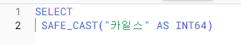
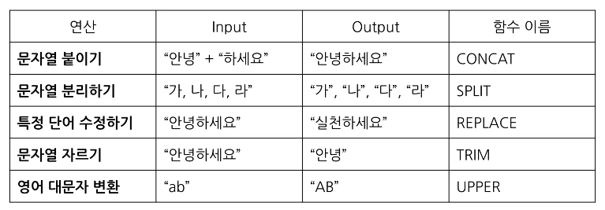

## 오류를 디버깅 하는 방법

 syntax : 문법
 syntax error : 문법 오류

 오류 메세지가 알려주고자 하는 것
 - 현재 작성한 방식으로 하면 답을 얻을 수 없어요 (길잡이 역할)
 - 이부분에 문제가 되어요 (문제 진단)

 오류가 발생하면
 -> 아 길잡이가 나를 더 좋은 길로 나아가게 하려는구나!

### 대표적인 오류 카테고리 : Syntax Error (문법 오류)
- 문법을 지키지 않아 생기는 오류
- Error Message를 보고 번역 또는 해석한 후, 해결 방법  찾아보기
     - 구글에 검색
    - ChatGPT에 질문
    - 지인에게 질문


- 빨간 밑줄이 있으면 밑줄 앞뒤로 오류가 있을 가능성 큼


< Number of argurments does not match for aggregate function COUNT

```
SELECT
 COUNT (id, kor_name)
FROM basic.pokemon
```
해석 : 집계 함수 COUNT의 인자 수가 일치하지 않습니다. 

=> 
COUNT(1개만 들어가야됨)

< SELECT list expression references column type1 a which is neither grouped nor aggregated 

```
SELECT
 type1,
 COUNT (id) AS cnt
FROM basic.pokemon
```
해석 : SELECT 목록 식은 다음에서 그룹화되거나 집계되지 않은 열을 참조합니다. 

=> GROUP BY에 적절한 컬럼을 명시하지 않았을 경우 발생하는 오류

< Syntax error : Expected end of input but got keyword SELECT>

```
SELECT
 type1,
 COUNT (id) AS cnt
FROM basic.pokemon
GROUP BY 
 type1

SELECT
*
FROM basic.trainer
```
해석 : 입력이 끝날 것으로 예상되었지만 SELECT 키워드가 입력되었습니다.

- SELECT 근처 확인하기
- 하나의 쿼리엔 SELECT가 1개만 있어야 함
- 혹은 쿼리가 끝나는 부분에 ; 붙이고 실행할 부분만 드래그 앤 드랍해서 실행하기 

< Syntax error : Expected end of input but got keyword WHERE at [5:1]>

```
SELECT
 *
FROM basic.trainer LIMIT 10
WHERE
 id=3
```
해석 : 입력이 끝날 것으로 예상되었지만 [5:1]에서 키워드 WHERE을 얻었습니다. 
- limit을 옮기거나 삭제하면됨

## 데이터 변환
### 변화을 위한 함수
- SELECT 문에서 데이터를 변환시킬 수 있음
    - 또는 WHERE의 조건문에도 사용할 수도 있음
- 데이터의 타입에 따라 다양한 함수가 존재 

```
SELECT
 칼럼1,
 칼럼2,
 칼럼3
FROM 테이블
WHERE <조건문>
GROUP BY <집계할 컬럼>
```

### 데이터 타입 
숫자, 문자, 시간날짜, 부울(Bool  )

### 데이터 타입이 중요한 이유
- 보이는 것과 저장된 것의 차이가 존재한다
    - 엑셀에서 보면 빈값 => ""일 수도 있고, NULL일 수도 있음
    - 1이라고 작성된 경우 => 숫자 1일 수도 있고, 문자 1일 수도 있음
    - 2023-12-31 => DATE 2023-12-31 일 수도 있고, 문자 2023-12-31 일 수도 있음
    - 내 생각과 다른 경우 데이터의 타입을 서로 변경해야 함

### 자료 타입 변경하기
자료 타입을 변경하는 함수 : SAFE_CAST
- SAFE_가 붙은 함수는 변환이 실패할 경우 NULL 변환됨



## 문자열(STRING) 함수 

문자열 : "안녕하세요" 같이 " " 형태로 된

문자열 데이터로 할 수 있는 대표적인 연산 



- 문자열 붙이기 => CONCAT
```
SELECT
 CONCAT("안녕","하세요") AS result
```
From이 없는데 어떻게 동작하지?
CONCAT 인자로 STRING이나 숫자를 넣을 때는 데이터를 직접 넣어준 것 => FROM이 없어도 실행 가능

- 문자열 분리하기 => SPLIT
```
SELECT 
 SPLIT(문자열_원본, 나눌 기준이 되는 문자) AS result
```

- 특정 단어 수정하기 => REPLACE
```
SELECT
 REPLACE(문자열 원본, 찾을 단어, 바꿀 단어 ) AS result
```
- 문자열 자르기 => TRIM
```
SELECT
 TRIM(문자열 원본, 자를 단어 ) AS result
```

- 영어 소문자를 대문자로 변경 => UPPER
```
SELECT
 UPPER(문자열 원본) AS result
```


## 날짜 및 시간 데이터 이해하기 

### 시간 데이터 다루기
- 시간 데이터도 세부적으로 나눌 수 있음
- DATE, DATETIME, TIMESTAMP 등

- DATE : DATE만 표시하는 데이터, 2023-12-31
- DATETIME :  DATE와 TIME까지 표시하는 데이터(DATE + TIME), Time Zone 정보 없음, 2023-12-31 14:00:00
- TIME : 날짜와 무관하게 시간만 표시하는 데이터, 23:59:59:00

millisecons(ms)
- 시간의 단위, 천 분의 1초(1,000ms = 1초)
- 우리가 아는 초보다 더 짧은  시간 단위
- 눈을 깜빡이는 시간이 약 100ms
- 빠른 반응이 필요한 분야에서 사용(초보다 더 정확하게)
- Millisecond => TIMESTAMP => DATETIME으로 변경 

microsecond
- 1/1,000ms, 1/1,000,000초

### 타임존
GMT : Greenwich Mean Time (한국시간 : GMT+9)
- 영국의 그리니치 천문대(경도 0도)를 기준으로 지역에 따른 시간의 차이를 조정하기 위해 생긴 시간의 구분선 (1884년 채택)
-영국 근처에서 자주 활용

UTC : Universal Time Coordinated (한국 시간: UTC+9)
- 국제적인 표준 시간
- 협정 세계시
- 타임존이 존재한다 = 특정 지역의 표준 시간대 

TIMESTAMP
- 시간 도장
- UYC부터 경과한 시간을 나타내는 값
- Time Zone 정보 있음
- 2023-12-31 14:00:00 UTC

DATETIME 쓸때는 timezone 꼭 넣는것 유의하기 