**4-4. 날짜 및 시간 데이터 이해하기**
------------------------------------------------------------------------------------------------

CURRENT _DATETIME([time_zone]) : 현재 Datetime 출력

**EXTRACT** : Datetime 에서 특정 부분만 추출하고 싶은 경우  

- 날짜, 년도, 월, 일, 시간, 시, 분 단위로 특정 부분만 추출하는 함수

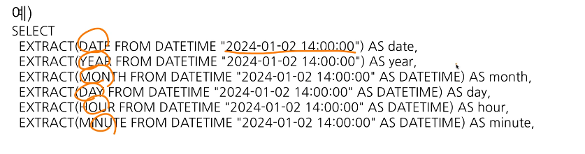 

- 요일을 추출하고 싶은 경우

  **EXTRACT(DAYOFWEEK FROM datetime_col)**
  - 한 주의 첫날이 일요일인 [1,7] 범위의 값을 반환
  - 주말만 찾고 싶으면 IN 조건 혹은 CASE WHEN 조과 함께 1,7 만 찾을 수 있음

- DATE 와 HOUR만 남기고 싶은 경우 => 시간 자르기

  **DATETIME_TRUNC(datetime_col, HOUR)**
  - "2021-01-01 14:42:13" 을 HOUR로 자르면 "2024-01-02 14:00:00"
  - 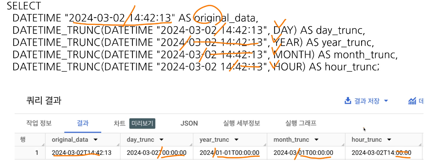
 
- 문자열로 저장된 DATETIME을 DATETIME 타입으로 바꾸고 싶은 경우

  **PARSE_DATETIME('문자열의 형태', 'DATETIME 문자열') AS datetime**

- DATETIME 타입 데이터를 특정 행태의 문자열 데이터로 변환하고 싶은 경우
  **SELECT_DATETIME("%c", DATETIME "2024-01-11 12:35:35") AS formatted;**


- 마지막 날을 알고 싶은 경우; 자동으로 월의 마지막 값을 계산하여 특정 연산을 할 경우
  **LAST_DAY(DATETIME) : 월의 마지막 값을 반환**

- 두 DATETIME 의 차이를 알고 싶은 경우
  **DATETIME_DIFF(첫 DATETIME, 두 번째 DATETIME, 궁금한 차이)**

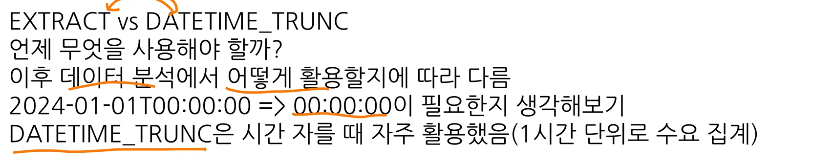

**4-5. 연습문제 1~5**

- != : 같지 않다 

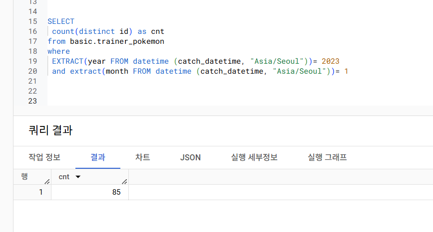

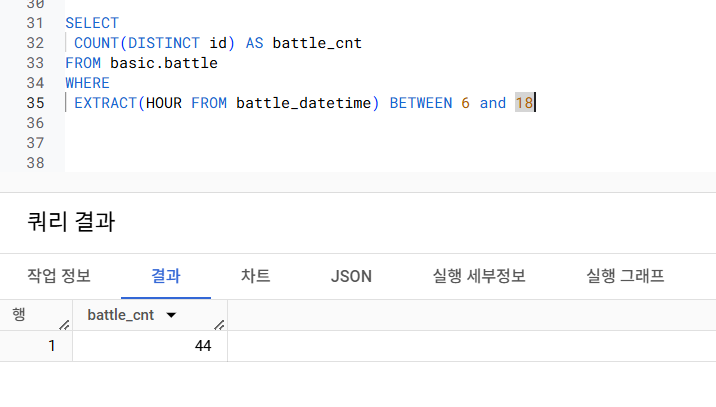

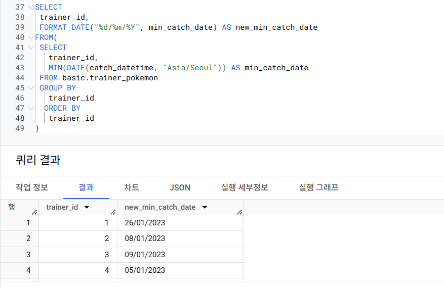

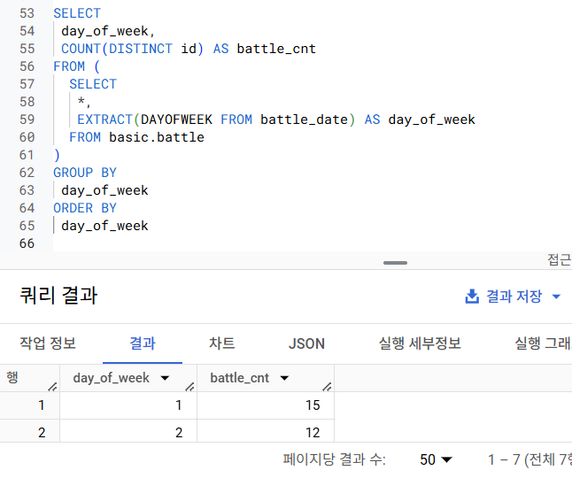

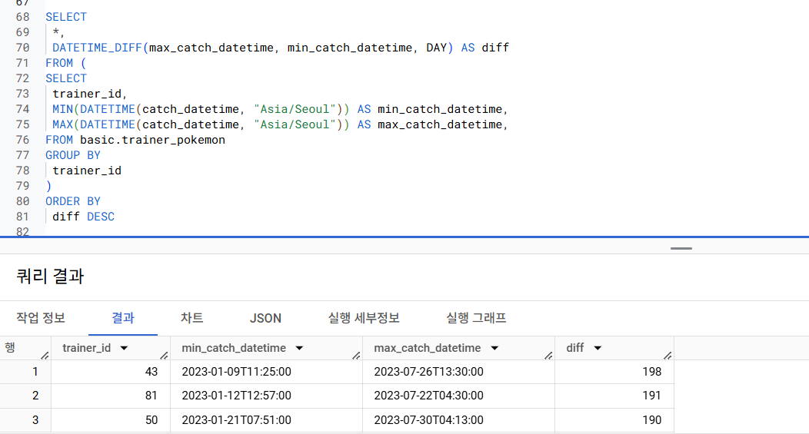

---

**4-6. 조건문 함수**

- 조건문
  - 만약 특정 조건이 충족되면, 어떤 행동을 하자
  - 특정 조건이 참일 때 A, 아니면 B
    - 조건에 따른 분기 처리가 필요한 경우
   - 조건에 따른 다른 값을 표시하고 싶을 때 사용

- 조건문을 사용하는 방법
1.  CASE WHEN
    - 
     - 여러 조건이 있을 경우 유용
     - 순서가 매우 중요함
     - 조건1, 조건2에 둘 다 해당하면 앞선 순서를 따름
     - 문자열 함수(특정 단어 추출)에서 이슈가 자주 발생한다. 
     ```
     SELECT
      CASE
       WHEN 조건1 THEN 조건1이 참일 경우 결과
       WHEN 조건2 THEN 조건2가 참일 경우 결과
       ELSE 그 외 조건일 경우 결과
    END AS 새로운_칼럼_이름
    ```
  
   
2. IF
   - 
   - 단일 조건일 경우 유용 

   ```
   IF(조건문, True일 때의 값, False일 때의 값) AS 새로운_칼럼_이름
   ```

**4-6. 조건부 함수 연습 문제 1~6**

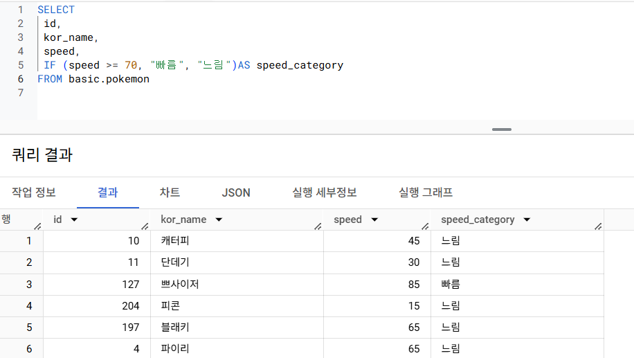

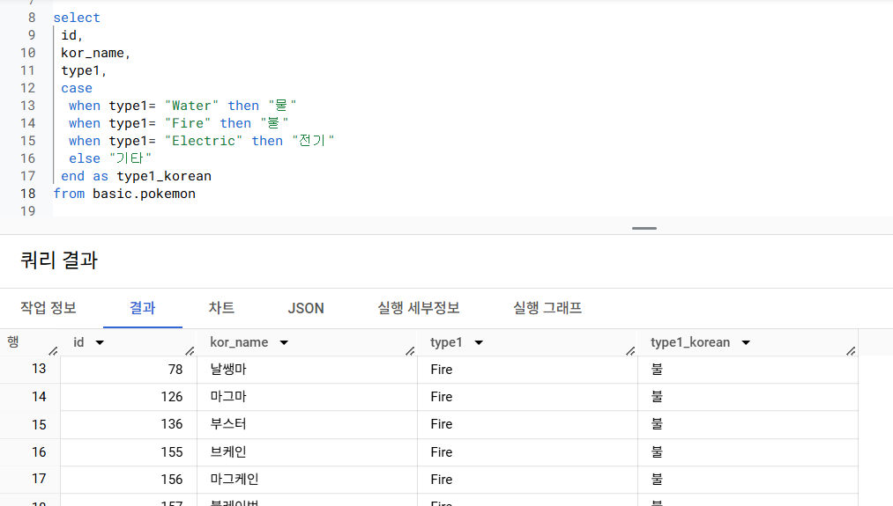

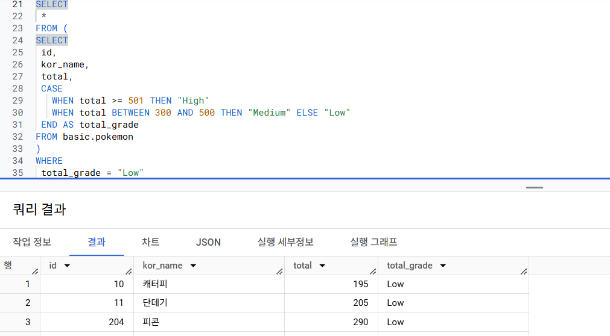

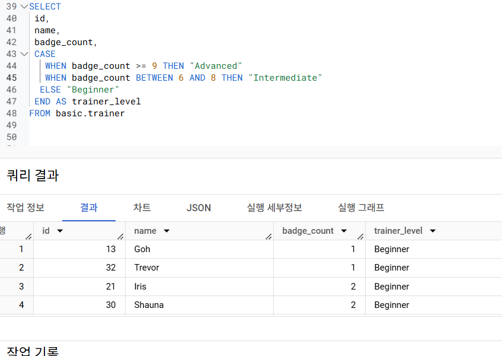

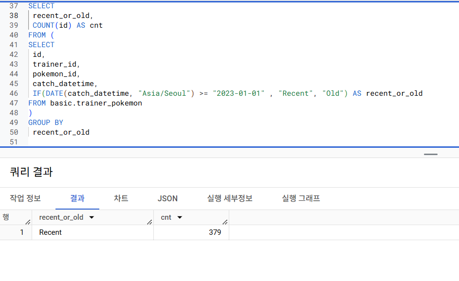

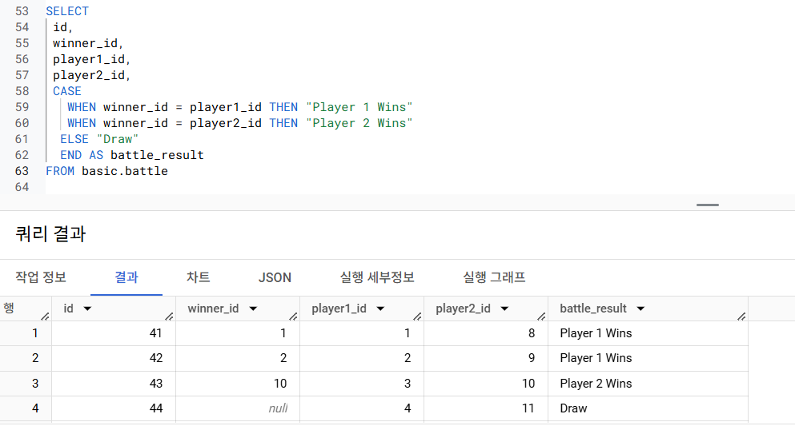


**4-9. BigQuery 공식 문서 확인하는 법**

- 개발 공식 문서 찾는 방법 : "기술명 + documentation"으로 검색 
    