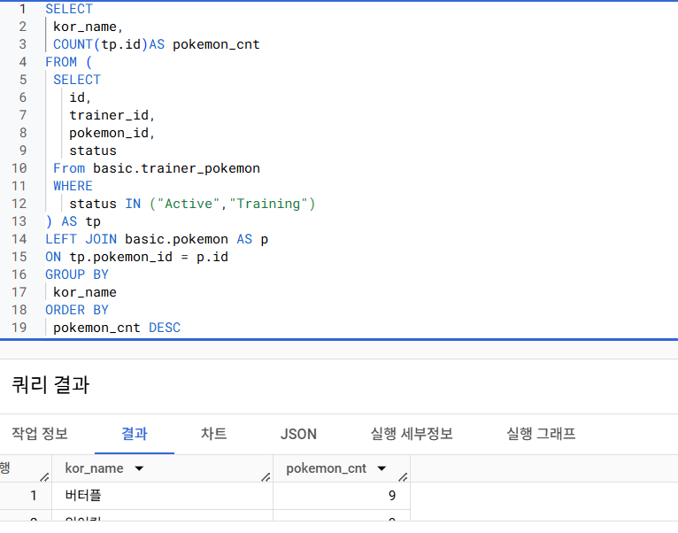
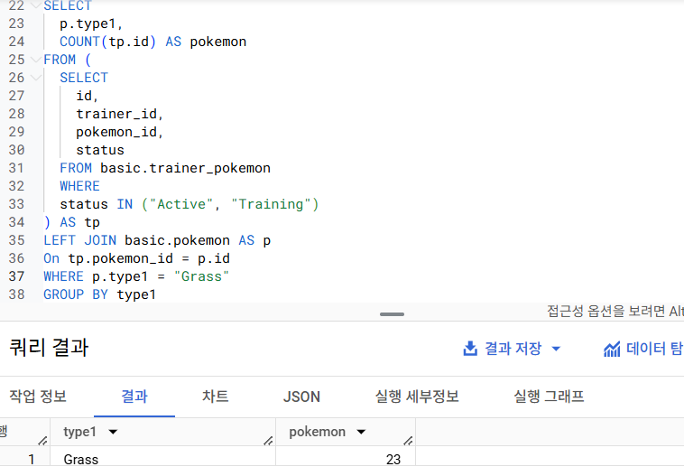
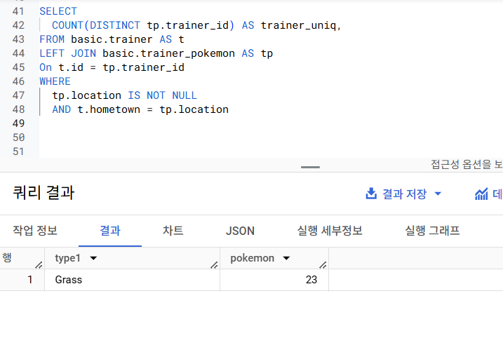
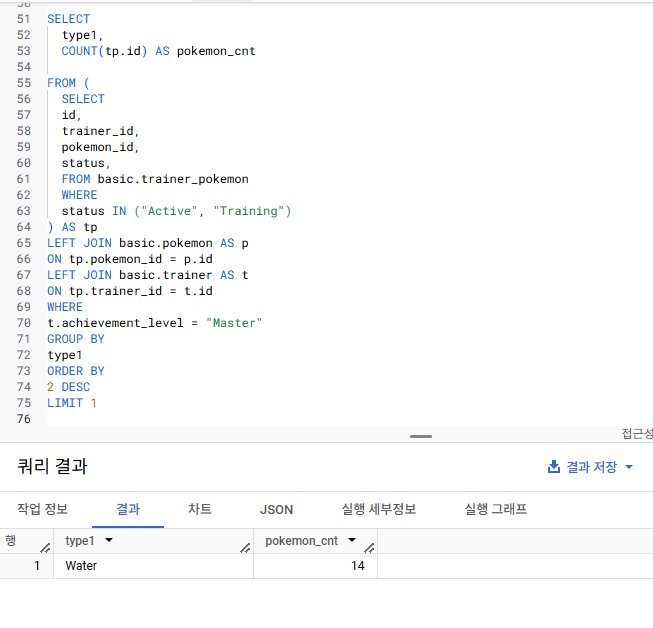
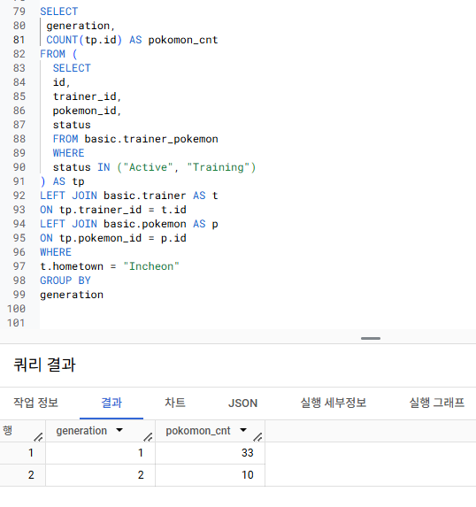

# 5. Intro
# 5-1. JOIN  이해하기 
> 서로 다른 데이터 테이블을 연결하는 것 - 두 테이블 속 공통 key를 기준으로 테이블을 합친다 ! = 컬럼 추가

### JOIN을 해야하는 이유
관계형 데이터베이스 설계시 정규화 과정을 거치게 되는데 이 과정에서 데이터가 분리되어 있는 것이 좋음. 그래서 분석할 때 JOIN 시키는 것.

# 5-2. 다양한 JOIN 방법
```SQL
INNER JOIN : 두 테이블의 공통 요소 - 교집합
LEFT/RIGHT JOIN : 기준 요소로 연결 - A or B
FULL JOIN : 키를 모두 연결하고 NULL값은 그냥 둠 - 합집합
CROSS JOIN : 각각 행을 서로 곱함.  데이터가 뻥튀기될 수 있음
```

# 5-3.JOIN 쿼리 작성하기 
1. 테이블 확인 : 테이블에 저장된 데이터, 컬럼 확인
2. 기준 테이블 정의 : 가장 많이 참고할 기준 (base) 테이블 정의
3. JOIN Key 찾기 : 여러 Table과 연결할 Key(ON) 정리
4. 결과 예상하기 
5. 쿼리 작성/ 검증

```SQL
SELECT
  A.col1,
  A.col2,
  B.col1,
  B.col2
FROM table1 AS A
LEFT JOIN table2 AS B
ON A.key = B.key 
```  
### FROM > JOIN > ON 순서로  

### JOIN 하고 또 JOIN도 가능함

```SQL
SELECT 
    tp.id,
    tp.trainer_id,
    tp.pokemon_id,
    t.id AS trainer_id,
    t.age,
    t.hometown,
    p.*
FROM `ty-practice-435200.basic.trainer_pokemon` AS tp
LEFT JOIN `ty-practice-435200.basic.trainer` AS t
ON tp.trainer_id = t.id
LEFT JOIN `ty-practice-435200.basic.pokemon` AS p
ON tp.pokemon_id = p.id;
```

# 5-4. JOIN을 처음 공부할 때 헷갈렸던 부분
### 1) 여러 JOIN 중 어떤 것을 사용해야할까?
 - 하려고 하는 작업의 목적에 따라 JOIN 선택해보기
   - 교집합: INNER
   - 모두 다 조합: CROSS
   - 그게 아니면 LEFT/RIGHT: LEFT 추천 

### 2) 어떤 Table을 왼쪽에 두고, 어떤 Table이 오른쪽에 가야할까?
 - LEFT JOIN의 경우
   - 기준이 되는 Table을 왼쪽에 두기 
   - 우측에 데이터를 계속 추가

### 3) 어떤 Table을 연결할 수 있는걸까?
 - JOIN의 개수에 한계는 없음
 - BUT 너무 많이 하는건 안좋음. 3~5개 정도가 적당?

### 4) 컬럼은 모두 다 선택해야 할까?
- 칼럼 선택은 데이터를 추출해서 무엇을 하고자 하냐에 따라 다름. 
- 사용하지 않을 컬럼을 선택하지 않는게 중요
- id 같은 값은 Uinque한지 확인하기 위해 자주 사용되므로 id는 자주 사용하는 편

### 5) NULL 이 대체 뭘까?
- NULL : 값이 없음, 알 수 없음
- 0이나 공백과 다르게 값이 아예 없는 것
- JOIN에선 연결할 값이 없는 경우 나타남


# 연습문제 

### 1


### 2


### 3


### 4


### 5



