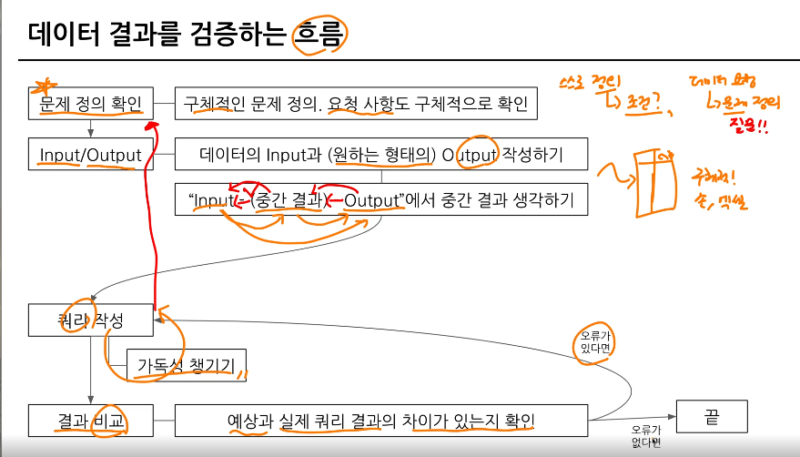

## 6-2. 가독성을 챙기기 위한 SQL 스타일 가이드 
- 데이터 결과 검증 전단계에서 실수 발생 가능
  -  문법을 잘못 알고 있는 경우, 데이터 파악이 안된 경우, 쿼리가 복잡한 경우 
- 조직마다 다른 가이드를 사용할 수 있음

### 1. 예약어는 대문자로 작성
- SQL에서 문법적인 용도로 사용하고 있는 문자들은 대문자로 작성 
- 예약어 대표적 예시 : SELECT, FROM, WHERE, AS, 각종 함수

### 2. 칼럼 이름은 snake_case 로 작성
- 칼럼 이름은 CamelCase 가 아닌 sanke_case로 작성 (단, 회사의 기준이 CamelCase면 사용. 결국 일관성이 중요한거임)

### 3. Alias로 별칭 지을 때는 명시적인 이름 쓰기
- AS a, AS b 등 컬럼의 의미를 한번 더 생각하게 하는 이름이 아닌 명시적인 것을 사용하자
- JOIN 할 때 테이블의 이름도 명시적으로 할 수 있다면 명시적으로 진행하기
- AS를 생략해서 별칭을 설정할 수도 있는데, AS를 쓰는 것도 명시적인 표현

### 4. 왼쪽 정렬
- 기본적으로 왼쪽 정렬을 기준으로 작성하자

### 5. 예약어나 컬럼은 한 줄에 하나씩 권장
- 컬럼은 바로 주석처리할 수 있는 장점이 있기에 한 줄에 하나씩 작성

좋은예
```SQL
SELECT
 col1,
 col2,
 col3
FROM table
WHERE
```
안좋은예
```SQL
SELECT col1,col2,col3
FROM table
```

### 6. 쉼표는 컬럼 바로 뒤에 


## 6-3. 가독성을 챙기기 위한 WITH문 & 파티션

### WITH 구문
- CTE(Common Table Expression) 라고 표현
- SELECT 구문에 이름을 정해주는 것과 유사
- 쿼리 내에서 반복적으로 사용할 수 있음
- 쿼리의 최상단에 사용
- 쿼리를 정의해 재사용 가능

사용방법
```SQL
WITH name_a AS (
    SELECT
     col
    FROM table
), name_b AS (
    SELECT
     col2
    FROM Table2
)

SELECT
 col
FROM name_a
```

### PARTITION
- 쿼리 성능 향상, 데이터 관리 용이, 비용 절감 
- WHERE 절에 파티션 칼럼에 대해 조건을 설정해서 사용

사용방법
```SQL
SELECT 
  id,
  player1_id,
  player2_id
FROM `til-bigquery.basic.battle` 
WHERE battle_datetime BETWEEN DATETIME("2022-01-16") AND DATETIME_ADD("2024-11-16", INTERVAL 1 DAY) 
;

WITH sample AS (
  SELECT 
    id,
    player1_id,
    player2_id
  FROM `til-bigquery.basic.battle` 
), sample2 AS (
  SELECT
    id,
    name,
    hometown
  FROM basic.trainer
  WHERE
    id = 3
)
SELECT
  *
FROM sample2
```

## 6-4. 데이터 결과 검증 정의
- SQL 쿼리 후 얻은 결과가 예상과 일치하는지 확인하는 과정
- 목적 : 분석 결과의 정확성, 신뢰성 확보 



### 데이터 결과 검증할 때 자주 활용하는 SQL 쿼리

대표적으로 활용하는 SQL 문법
1) COUNT(*) : 행 수를 확인, 의도한 데이ㅓ의 행 개수가 맞는가?
2) NOT NULL : 특정 컬럼에 NULL이 존재하는가? 필수 필드가 비어있지 않는가?
3) DISTINCT : 데이터의 고유값을 확인해 중복 여부 확인
4) IF문, CASE WHEN : 의도와 같다면 TRUE, 아니면 FALSE


## 6-5. 데이터 결과 검증 예시
프로세스 흐름
1. 전체 데이터 파악 
2. 특정 user_id 선정 
```SQL
SELECT
    *
FROM basic.battle
WHERE
    (player1_id = 7) OR (player2_id);
```
3. 결과 예상 (여기선 player_id 가 7인 경우의 승률을 직접 COUNT )
4. 쿼리 작성
5. 실제와 비교 
```SQL
# 통합 데이터 생성 (player 1, 2 구분을 하지 않아도 되는 테이블 => trainer_id 생성)
SELECT
  *
FROM (
  SELECT
    id AS battle_id,
    player1_id AS trainer_id,
    winner_id
  FROM basic.battle
  UNION ALL
  SELECT
    id AS battle_id,
    player2_id AS trainer_id,
    winner_id
  FROM basic.battle
)
ORDER BY battle_id;

# trianer_id=7의 총 배틀 횟수를 구하는 쿼리
WITH battle_basic AS (
  SELECT
    id AS battle_id,
    player1_id AS trainer_id,
    winner_id
  FROM basic.battle
  UNION ALL
  SELECT
    id AS battle_id,
    player2_id AS trainer_id,
    winner_id
  FROM basic.battle
)
SELECT
  trainer_id,
  COUNT(*) AS total_battles,
  COUNT(DISTINCT battle_id) AS unique_battles
FROM battle_basic
WHERE trainer_id = 7
GROUP BY
  trainer_id;

# trainer_id와 winner_id를 조합해서 WIN, LOSE, DRAW를 만들어보기
WITH battle_basic AS (
  SELECT
    id AS battle_id,
    player1_id AS trainer_id,
    winner_id
  FROM basic.battle
  UNION ALL
  SELECT
    id AS battle_id,
    player2_id AS trainer_id,
    winner_id
  FROM basic.battle
)
SELECT
  *,
  CASE
    WHEN trainer_id = winner_id THEN "WIN"
    WHEN winner_id IS NULL THEN "DRAW"
    ELSE "LOSE"
  END AS battle_result
FROM battle_basic
WHERE trainer_id = 7
;

# COUNTIF를 사용해서 값 구하기 
WITH battle_basic AS (
  SELECT
    id AS battle_id,
    player1_id AS trainer_id,
    winner_id
  FROM basic.battle
  UNION ALL
  SELECT
    id AS battle_id,
    player2_id AS trainer_id,
    winner_id
  FROM basic.battle
), battle_with_result AS (
  SELECT
  *,
  CASE
    WHEN trainer_id = winner_id THEN "WIN"
    WHEN winner_id IS NULL THEN "DRAW"
    ELSE "LOSE"
  END AS battle_result
FROM battle_basic
WHERE trainer_id = 7
)
SELECT
  trainer_id,
  COUNTIF(battle_result = "WIN") AS win_count,
  COUNT(battle_id) AS total_battle_count,
  COUNTIF(battle_result = "WIN")/COUNT(DISTINCT battle_id) AS win_ratio
FROM battle_with_result
GROUP BY
  trainer_id
```
6. 맞다면 특정 유저 조건 제외 
```SQL
WITH battle_basic AS (
  SELECT
    id AS battle_id,
    player1_id AS trainer_id,
    winner_id
  FROM basic.battle
  UNION ALL
  SELECT
    id AS battle_id,
    player2_id AS trainer_id,
    winner_id
  FROM basic.battle
), battle_with_result AS (
  SELECT
  *,
  CASE
    WHEN trainer_id = winner_id THEN "WIN"
    WHEN winner_id IS NULL THEN "DRAW"
    ELSE "LOSE"
  END AS battle_result
FROM battle_basic
--WHERE trainer_id = 7
)
SELECT
  trainer_id,
  COUNTIF(battle_result = "WIN") AS win_count,
  COUNT(battle_id) AS total_battle_count,
  COUNTIF(battle_result = "WIN")/COUNT(DISTINCT battle_id) AS win_ratio
FROM battle_with_result
GROUP BY
  trainer_id
HAVING
total_battle_count >= 9
```

