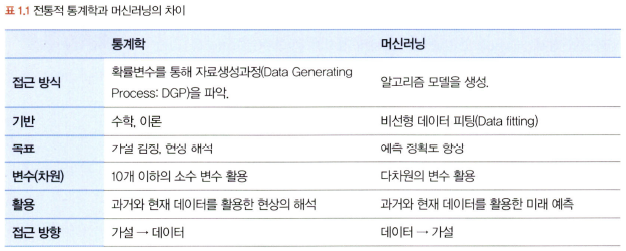

# 통계학 1주차 정규과제

📌통계학 정규과제는 매주 정해진 분량의 『*데이터 분석가가 반드시 알아야 할 모든 것*』 을 읽고 학습하는 것입니다. 이번 주는 아래의 **Statistics_1st_TIL**에 나열된 분량을 읽고 `학습 목표`에 맞게 공부하시면 됩니다.

아래의 문제를 풀어보며 학습 내용을 점검하세요. 문제를 해결하는 과정에서 개념을 스스로 정리하고, 필요한 경우 추가자료와 교재를 다시 참고하여 보완하는 것이 좋습니다.

1주차는 `1부. 데이터 기초체력 기르기`를 읽고 새롭게 배운 내용을 정리해주시면 됩니다.


## Statistics_1st_TIL

### 1부. 데이터 기초체력 기르기
### 01. 통계학 이해하기
### 02. 모집단과 표본추출
### 03. 변수와 척도
### 04. 데이터의 기술 통계적 측정
### 05. 확률과 확률변수
### 06. 확률분포
### 07. 가설검정

## Study Schedule

|주차 | 공부 범위     | 완료 여부 |
|----|--------------|----------|
|1주차| 1부 ~p.79    | ✅      |
|2주차| 2부 ~p.120   | 🍽️      | 
|3주차| 2부 ~p.202   | 🍽️      | 
|4주차| 2부 ~p.299   | 🍽️      | 
|5주차| 3부 ~p.356   | 🍽️      | 
|6주차| 3부 ~p.437   | 🍽️      | 
|7주차| 3부 ~p.542   | 🍽️      | 
|8주차| 3부 ~p.615   | 🍽️      | 
|9주차|데이터 분석 실습| 🍽️      |

<!-- 여기까진 그대로 둬 주세요-->

# 01. 통계학 이해하기

```
✅ 학습 목표 :
* 통계학의 필요성을 안다.
* 기술통계와 추론통계의 특성을 구분하여 이해한다.
```
<!-- 새롭게 배운 내용을 자유롭게 정리해주세요.-->
[데이터 과학의 프로세스]

데이터 수집 > 데이터 가공 > 탐색적 데이터 분석 EDA, 데이터 시각화 > M/L 모델링 > 결과 해석 및 적용 

## 1.2 머신러닝과 전통적 통계학의 차이

### 머신러닝

- 주된 목적: 예측 + 예측력이 얼마나 높은가에 집중  
- 그렇기 때문에 분석 모형의 복잡성이 높으며, 
- 고질적인 문제인 과적합(학습 데이터를 과하게학습하여 예측 데이터에 대한 정확도가 감소하는 현상) 해결에 집중함
- 확률변수를 통해 통계적 수치를 검정하는 방향으로 접근
- 가설을 설정 -> 데이터 확인

### 통계학
- 주된 목적은 해석 -> 모델의 신뢰도를 중시
- 복잡성<단순성 
- 각 변수의 영향력에 대한 해석과 모집단에서 추출한 샘플의 가정과 통계적 적합성에 집중
- 수십, 수백 개의 변수를 활용하여 모델을 만듦
- 데이터를 기반으로 가설을 끌어내어 검증



## 1.4 통계학의 정의와 기원

### 1.4.1 기술 통계
기술 통계는 문자 그대로 주어진 데이터의 특성을 사실에 근거하여 설명하고 묘사하는 것

"기술(통계) = descriptive = 서술[묘사]하는, 사실에 근거한, 설명적인, 도형의"
- 전체 데이터을 쉽고 직관적으로 파악할 수 있도록 설명해 주는 것
- 기술 통계를 내는 것 = EDA(탐색적 데이터 분석, 날것의 데이터를 의사결정을 위한 정보로 탈바꿈하는 것)
- 기술통계는 보통 시각화를 많이 사용함

### 1.4.2 추론 통계
추론 통계 목적 : 표본 집단으로부터 모집단의 특성을 추론하는 것 (한 학급의 통계치를 통해 학교 전체 학생의 통계치를 추정하는 것)

"추론(통계) = interential = 추리의, 추정에 의한"

"표본의 특성을 분석 > 특성의 일반화 여부 판단 > 모집단의 특성으로 추정"

.png) 

# 02. 모집단과 표본추출

```
✅ 학습 목표 :
* 모집단과 표본, 모수와 통계량의 정의와 관계를 설명할 수 있다.
* 분석가가 비논리적인 추론을 내리는 패턴인 인지적 편향의 종류를 이해한다.
* 편향과 분산의 차이를 이해한다.
```

<!-- 새롭게 배운 내용을 자유롭게 정리해주세요.-->

## 2.1 모집단과 표본, 전수조사와 표본조사 

모집단 : 분석 대상 전체의 집합

표본 : 모집단의 부분집합, 모집단의 일부를 추출한 것

전수조사: 모집단의 자료 전체를 조사 및 분석하여 정보를 추출하는 것

표본조사: 모집단에서 추출한 표본을 통해 모집단의 정보(평균, 표준편차 등)를 추정하고 검정하는 것

.png)

## 2.2 표본조사를 하는 이유와 데이터과학 적용 방법

예측 및 분류 모델링 단계 : 적절한 표본을 추출해서 진행하고 전체 프로세스가 완성됐을 때 전체의 데이터를 사용하여 최종적인 모델 성능을 확인하고 예측 및 분류를 하는게 좋음

- 전수 데이터를 사용할 때도, 이상치 제거 및 결측값 처리, 데이터 표준화의 기법 필요 

### 표지 재포획법

관악구에 살고 있는 길고양이가 총 몇마리일까?
-> 표지 재포획법 사용

관악구의 길고양이 중 일부, 100마리 포획, 표식을 남기고 풀어줌

며칠 정도 시간이 지나고, 다시 무작위로 길고양이 100마리 포획

이렇게 표식이 있는 길고양이의 비율을 통해 관악구의 길고양이 모집단 수를 추정 가능

.png)

## 2.3 표본추출에서 나타나는 편향의 종류

표본 오차: 모집단과 표본의 자연 발생적인 변동

=> 같은 크기의 두 개의 표본을 주의해서 추출해도 완전히 동일한 표본을 얻는 것은 불가능함

비표본 오차: 표본 오차를 제외한 변동

### 편향: 표본에서 나타나는 모집단과의 체계적인 차이
    
- 표본추출편향(sample selection bias): 표본 추출 과정에서 체계적인 경향이 개입되어 모집단에서 편향된 표본만 추출되는 경우
- 가구편향(household bias): 모집단의 부분 집단 단위에서 하나의 관측치씩 추출하는 경우 크고 적은 집단이 작고 많은 집단보다 적게 추출되는 경우
- 무응답편향(non-response bias): 설문에 응답하지 않은 사람들과 응답하는 사람들에 체계적인 차이가 있는 경우
- 응답편향(response bias): 설문 형식의 문제. 응답자의 심리적 이슈에 의해 표본이 영향을 받는 경우 


확률화: 모집단으로부터 편향이 발생하지 않는 표본을 추출하는 방법 -> 이렇게 추출한 표본을 확률표본 
- 모집단에서 표본이 추출될 확률이 동등한지 여부에 따라 확률추출과 비확률추출로 구분

## 2.4 인지적 편향의 종류 

인지적 편향: 사람들은 언제나 합리적으로 생각하고 행동하는 것이 아니며, 휴리스틱을 통해 왜곡된 지각으로 결정하는 경우가 많음

### 확증 편향(confirmation bias)
자신이 본래 믿고 있는 대로 정보를 선택적으로 받아들이고 임의로 판단하는 편향

- 확증편향에 의해 처음부터 생각해 두었던 가설에 유리한 방향으로 정보를 수집하고 해석하는 것은 명백한 오류, 분석의 신뢰성 떨어뜨림
- 방지하기 위해 두 명 이상의 분석가가 크로스 체크, 블라인드 분석 수행

### 기준점 편향(anchoring bias)
분석가가 가장 처음에 접하는 정보에 지나치게 매몰되는 편향
- 처음 표본을 통해서 나왔던 통계가 머릿속에 각인되어, 다른 분석 결과를 무시하거나 과소평가하는 것

### 선택 지원 편향(choice-supportive bias)
본인이 의사결정을 내리는 순간 그 선택의 긍정적인 부분에 대해 더 많이 생각하고 그 결정에 반대되는 증거를 무시하게 되는 편향


### 분모 편향(denominator bias)
분수 전체가 아닌 분자에만 집중하여 현황을 왜곡하여 판단하게 되는 편향

### 생존자 편향(survivorship bias)
소수의 성공한 사례를 일반화된 것으로 인식함으로써 나타나는 편향 

## 2.5 머신러닝 모델 측면의 편향과 분산 
편향: 예측값들이 정답과 일정하게 차이가 나는 정도

분산: 주어진 데이터 포인트(예를 들어 평균)에 대한 모델 예측의 가변성

.png) 

### - 편향과 분산은 트레이드오프 관계
- 예측이나 분류 모델을 만들 때 주어진 학습 데이터에 잘 맞도록 모델을 만들수록 편향은 줄어들고 분산은 증가함

.png)

- 모델의 복잡도가 상승할수록 편향은 감소하지만 분산은 증가 

## 2.6 표본 편향을 최소화하기 위한 표본 추출 방법

표본 추출 in 두 가지 관점 

1. 데이터 수집 단계의 표본 추출

모집단 확정
(조사대상이 되는 사람, 사물, 조직, 지역 등의 전체 집합을 구체적으로 정의)

↓

표본 프레임 결정
(모집단에 포함되는 조사 대상의 목록 설정)

↓

표본 추출방법 결정
(확률표본추출과 비활률표본추출, 복원과 비복원 추출 중 적절한 방법 선택)

↓

표본크기 결정
(조사의 유형, 시간, 예산 등을 고려하여 추출할 표본의 크기를 결정)

↓

표본추출
(선정된 조사 대상들을 추출)


2. 기업에서 이미 가지고 있는 몇 천만건의 고객 정보데이터, 인터넷 기업의 웹 로그 데이터 등과 같은 빅데이터에서 분석 모델링을 위한 적절한 크기의 표본데이터를 추출하는 것


- 거의 대부분의 경우에는 확률 표본추출방법을 사용
- 모집단의 모수에 대한 추론 가능
- 편향을 최대한 제거할 수 있어 표본의 신뢰도 높음

### 단순 임의 추출방법
- 제비뽑기, 로또 당첨 번호 선정하듯 표본을 추출
- 모집단의 모든 구성단위가 표본으로 선정될 확률 동일함 
- 모집단에 대한 사전지식이 없는 경우 유용
- 가장 쉽고 빠른 방법

### 계층적 표본추출방법
- 모든 구성단위에 일련번호를 부여한 뒤 일정한 간격으로 표본을 선택하는 방법
- 모집단 전체에 걸쳐 등간격으로 공평하게 표본이 추출
- 모집단 배열에 주기성이 있는 경우 표본의 대표성이 결여됨

### 층화 표본 추출방법
- 모집단이 특정한 기준으로 분류가 가능할 때 쓰일 수 있는 방법
- 표본을 단순 임의 추출방법으로 선정했을 때 표본이 편중될 수 있는 위험 보완

### 군집 표본추출방법
- 층화 표본추출방법처럼 모집단을 특정한 기준으로 분류한 뒤, 그중 하나의 소집단을 선택하여 분석하는 방법
- 하나의 소집단이 선택되면 소집단 전체나 일부를 표본추출
- 특정 기준으로 분류된 하나의 소집단만을 표본으로 두기 때문에 전체 모집단의 모수를 반영하지 못할 수도 있다는 단점

### 복원추출법(sampling with replacement:SWR)
- 처음 모집단에서 추출된 표본을 되돌려 넣고 다음 표본을 추출하는 방법
- 표본이 중복해서 선택될 수 있음
- 표본공간은 독립적으로 변화 X

### 비복원추출법(sampling without replacement:SWOR)
- 처음 모집단에서 추출된 표본을 되돌려 넣지 않고 다음 표본을 추출하는 방법
- 표본을 하나 하나 추출하는 행위는 표본공간을 바꾸는 종속사건이 됨
- 표본을 추출하면 다음 표본들의 추출 확률에 영향 O

###
# 03. 변수와 척도
```
✅ 학습 목표 :
* 독립변수, 종속변수에 대해 이해한다.
* 척도(변수의 데이터적 속성)의 종류를 알아본다.
* 척도에 따라 어떤 분석방법이 적절한지 판단할 수 있다.
```
<!-- 새롭게 배운 내용을 자유롭게 정리해주세요.-->
## 3.1 변수의 종류

이산변수: 정숫값

연속변수: 실숫값

독립변수 : 종속변수 = 원인 : 결과

.png)

- 독립변수와 종속변수는 서로 상관관계를 가짐
- 독립변수 간에도 상관관계가 없어야 함!
- 독립변수 간 상관관계가 높으면 독립변수들과 종속변수와의 연관성 측정이 어렵기 때문에 

통제변수 : 실험이나 설문조사를 할 때 종속변수에 영향을 줄 수 있는 외부 요소를 통제하기 위해 사용되는 변수

## 3.2 변수 관계의 종류

### 인과관계(casual relationship)
: 독립변수와 종속변수의 기본적 관계

### 상관관계(correlational relationship)
:변수 간에 관련성이 존재하는 관계
- 인과관계의 상위개념
- 단순히 변수 간에 상관성이 있으면 그 변수들은 상관관계인 것

### 독립관계(independent relationship)
: 변수 간에 상관성, 상관계수가 0인 관계
- 데이터 분석에 있어서 독립변수 간은 서로 독립관계여야 함

### 의사관계(spurious relationship)
: 변수 간에 상관성은 있지만, 그 상관성이 다른 변수에 의해 나타난 관계

### 양방향적 인과관계(reciprocal casuality)
: 두 변수가 서로 간에 인과적 영향을 미치는 관계

### 조절관계(moderating relationship)
: 독립변수와 종속변수 사이에서 강하고 불확정적인 영향을 미치는 관계

### 매개관계(meditational relationship)
: 독립변수와 종속변수 중간에서 매개변수가 개입되어 독립변수의 영향을 종속변수에 전달하는 관계 
- 시간적 차원이 포함
- 매개변수가 독립변수와 종속변수의 중간다리 역할을 하는 것 

## 3.3 척도의 종류 
척도: 측정하고자 하는 대상을 수치화하는 것에 사용되는 측정 도구
- 질적척도 (범주형 척도)
  - 명목척도 / 성별, 혈액형
  - 서열척도 / 석차, FIFA순위
- 양적척도 (연속형 척도)
  - 등간척도 / 온도, IQ 
  - 비율척도 / 몸무게, 매출액

.png)

.png)


# 04. 데이터의 기술 통계적 측정

```
✅ 학습 목표 :
* 산포도의 의미와 산포도를 측정하는 방법에 대해 설명할 수 있다.
* 정규분포의 왜도값과 첨도값이 얼마인지 답할 수 있다.
```

<!-- 새롭게 배운 내용을 자유롭게 정리해주세요.-->
## 4.1 중심 성향의 측정

중심성향: 평균값(mean), 최빈값(mode), 중앙값(median)

### 최빈값
: 데이터 중 가장 빈도가 높은 값
- 둘 이상 존재할 수 X
- 명목척도나 서열척도로 이루어진 데이터도 측정 가능

### 중앙값
: 데이터를 큰 수부터 내림차순으로 나열했을 때 중앙에 위치한 값

## 4.2 분산과 표준편차

분산과 표준편차는 데이터의 퍼진 정도를 파악할 수 있게 해주는 지표

## 4.3 산포도와 범위, 사분위수, 변동계수

### 산포도(dispersion)
:분산도라고도 불리며 대푯값을 중심으로 자료들이 흩어져 있는 정도

산포도 측정법
- 사분위수
- 백분위수
- 10분위수
- 변동계수 (표준편차를 산술평균으로 나누어 준 값)

## 4.4 왜도와 첨도 

### 왜도(skewness) 
: 데이터 분포의 좌우 비대칭도를 표현하는 척도
- 좌우대칭을 이룰수록 왜도는 작아지고, 한쪽으로 심하게 몰려있으면 커짐

왜도 측정법
- 피어슨의 비대칭 계수

  3(평균값-중앙값)/ 표본의 표준편차

  or

  3(평균값-최빈값)/ 표본의 표준편차


### 첨도(kurtosis)
: 분표가 정규분포보다 얼마나 뾰족하거나 완만한지의 정도를 나타내는 척도 
- 데이터가 중심에 많이 몰려 있을수록 뾰족, 두루 퍼지면 구릉 모양
- 첨도를 식으로 나타내면
  .png)


# 05. 확률과 확률변수

```
✅ 학습 목표 :
* 베이즈 정리의 개념을 이해하고 이를 실생활 예제에 적용할 수 있다.
* 심슨의 역설을 경계하여 데이터를 분석할 때 세부 그룹별 패턴을 고려해 잘못된 결론을 방지할 수 있다.
```

<!-- 새롭게 배운 내용을 자유롭게 정리해주세요.-->
### 베이지안 이론
: 특정한 사건 A가 발생하면 그 사건의 원인이 되는 사건들의 사전확률을 이용하여 사건 A의 원인이 될 수 있는 사후확률을 알아내는 것


### 심슨의 역설
: 데이터를 어떻게 나누고 결합하고 가공하는가에 따라 결과가 정반대로 바뀔 수 있음을 경계해야 할다는 것
- 통계적 결론이 나왔을 때, 항상 의심을 갖고서 데이터의 원천 단계에서부터 결과의 원인을 확인하는 습관을 가져야함


# 06. 확률분포

```
✅ 학습 목표 :
* 이산확률분포의 종류에 대해 알고, 각각의 특징과 활용 사례를 설명할 수 있다.
* 연속확률분포의 종류와 특징을 설명할 수 있다. 
* 중심극한정리(CLT)의 개념을 이해하고 설명 할 수 있다.
```
.png)

.png)

[이산확률분포와 연속확률분포 추가자료](https://velog.io/@tngus0325/%EC%9D%B4%EC%82%B0%ED%99%95%EB%A5%A0-%EB%B6%84%ED%8F%AC%EC%99%80-%EC%97%B0%EC%86%8D%ED%99%95%EB%A5%A0-%EB%B6%84%ED%8F%AC-%EC%A0%95%EB%A6%AC)

## 6.2. 이산확률분포

> **🧚 이산확률분포에 대해 학습한 내용을 정리해주세요.**

<!--수식과 공식을 암기하기보다는 분포의 개념과 특성을 위주로 공부해주세요. 분석 대상의 데이터가 어떠한 확률분포의 특성을 가지고 있는지를 아는 것이 더 중요합니다.-->
###  균등분포
: X가 동일한 확률을 가지는 분포

### 이항분포
: 동전의 앞뒤 혹은 성공/실패와 같이 1과 0의 값만을 갖는 분포
- 각 시행이 독립적


### 초기하분포
: 비복원추출로 각 시행이 독립적이지 않아서 시행마다 성공확률이 달라짐

### 포아송분포
: 일정한 관측 공간에서 특정 사건이 발생하는 횟수를 나타내는 이산확률분포
- 일정한 시공간 안에서 발생하는 사건의 횟수를 표현
- 표본의 크기라는 개념 존재X


## 6.3. 연속확률분포

> **🧚 연속확률분포에 대해 학습한 내용을 정리해주세요.**

<!--수식과 공식을 암기하기보다는 분포의 개념과 특성을 위주로 공부해주세요. 분석 대상의 데이터가 어떠한 확률분포의 특성을 가지고 있는지를 아는 것이 더 중요합니다.-->

- 연속확률분표는 확률변수 X가 특정 구간에 속할 확률을 구하는 것
- 확률밀도함수를 통해 전체 분포 중 특정 면적을 적분을 통해 분리하여 면적의 구간 안에서 사건이 발생할 확률을 계산함

### 정규분포 
평균 = 증앙값 = 최빈값


### 지수분포
: 특정 사건이 발생한 시점으로부터 다음 사건이 발생할 때까지의 시간을 확률변수값으로 하는 분포

- 발생하는 사건 다음 사건이 일어날 때까지 대기 시간을 다룬다는 것
- 절대적인 기준이 없고 평균에 따라 기울기가 정해짐


## 6.4. 중심극한정리

[중심극한정리 시뮬레이션](https://www.youtube.com/watch?v=aIPvgiXyBMI)

> **🧚 중심극한정리에 대해 학습한 내용을 정리해주세요.**
표본을 여러 번 추출했을 때, '각각의 표본' 평균들의 분포가 정규분포를 이룬다는 것.


- 표본 크기가 특정 수준(일반적으로 30개 이상)을 초과하면 표본 평균의 분포는 중심 극한 정리로 인해 정규 분포에 가까워짐
- 중심극한정리를 이용하면 모집단의 분포가 어떤 형태를 가지고 있는지 모르더라도, 표본을 충분히 추출한다면 표본 평균들의 분포가 정규분포를 이루기 때문에 통계적 추정이 가능해진다. 


# 07. 가설검정

```
✅ 학습 목표 :
* 귀무가설과 대립가설의 개념을 이해하고, 가설을 설정하는 원리를 설명할 수 있다.
* 가설검정의 유의수준과 p값의 의미를 이해하고, p값을 해석하여 귀무가설을 기각할지 여부를 판단할 수 있다.
* 1종 오류와 2종 오류의 차이를 설명하고, 실제 사례에서 어떤 오류를 더 중요하게 고려해야 하는지 분석할 수 있다.
```

<!-- 새롭게 배운 내용을 자유롭게 정리해주세요.-->

가설: 검정하고자 하는 주제. 연구문제에 대한 잠정적 결론

목적성에 따라 
.png)

.png)

귀무가설: 증명하고자 하는 가설고 반대되는 가설, 효과와 차이가 없는 가설

대립가설: 귀무가설이 기각됐을 때 대안적을 채택되는 가설(귀무가설과 반대되는 가설)

### 가설검정의 절차
가설 설정 > 유의수준 설정 > 실험 수행 > 검정 통계량 산출 > 대립가설 기각/채택

### 유의수준과 p값

가설검정에 의한 p값 < 유의수준 : 귀무가설 기각
가설검정에 의한 p값 > 유의수준 : 귀무가설 채택

### 1종 오류와 2종 오류

1종 오류: 귀무가설이 참임에도 불구하고 귀무가설을 기각하는 오류

(실제로 효과가 없는데 효과가 있다고 판단) 

2종 오류: 귀무가설이 거짓임에도 불구하고 귀무가설을 채택하는 오류

(실제로 효과가 있는데 효과가 없다고 판단)

<br>
<br>

# 확인 문제

## 문제 1.

> **🧚 어떤 분석 방법이 적절할까요?**
<br>

> 🔍 **Q1. 연속형 변수 간 유사성을 기반으로 그룹을
나누고자 하는 경우**   
Ex1) 고객을 유사한 구매 패턴이나 성향을 가진
그룹으로 나누는 경우   
Ex2) 유사한 주제를 가진 문서들을 같은 그룹으로
분류하는 경우

```
군집 분석 clustering
```

<br>

> 🔍 **Q2. 범주형 변수 간 인과관계를 확인하고자 하는 경우**   
Ex1) 광고 유형(A/B 테스트)과 고객 구매 여부 간의
관계를 분석하는 경우     
Ex2) 성별과 특정 질병 유무 간의 연관성을 분석
하는 경우

```
카이제곱? 로지스틱 회귀?
```

<br>

> 🔍 **Q3. 연속형 변수 간 인과관계가 존재하는 경우**   
Ex1) 광고비 지출과 매출 간의 관계를 분석하는 경우     
Ex2) 체중과 혈압 간의 관계를 분석하는 경우

```
회귀 분석
```

## 문제 2.

> **🧚Q. (주)다트비의 조일 과장은 이커머스 플랫폼의 마케팅 업무를 담당하고 있다. 최근 회사에서는 배너 광고의 클릭률(CTR)이 기대보다 낮아 최적의 광고 타겟층을 선정하는 프로젝트를 진행 중이다. 조 과장은 광고 효과를 높이기 위해 고민하던 중, 사이트 방문자의 70%가 모바일 유저, 30%가 PC 유저라는 정보를 알아냈다. 그래서 모바일 유저를 타깃으로 배너 광고를 올리면 되겠다 생각했는데 알고 보니 PC 유저의 광고 클릭률(CTR)이 5%로, 모바일 유저의 광고 클릭률(CTR)보다 4%p 높았다. 이런 경우, 모바일과 PC 중 어느 유저층에 집중하여 배너 광고를 올리는 것이 더 효과적일까? (소수점 둘째자리까지 반올림하여 답해주세요.)**

> 💝 **Hint**   
-P(클릭)을 구한다.  
-P(모바일 유저|클릭)과 P(PC 유저|클릭)을 구하고 값을 비교한다.

<!-- 베이즈 정리를 이해하였는지 확인하기 위한 문제입니다. 문제의 답과 풀이를 작성해주세요. 힌트를 참고하셔도 좋습니다.-->

```
P(클릭)= 0.01*0.7+ 0.05*0.3=0.007+0.015=0.022

P(모바일 유저|클릭)=0.01*0.7/0.022=0.31818182

P(PC 유저|클릭)=0.05*0.3/0.022=0.68181818

PC 유저!!!(68.18%)
```

## 문제 3.

> **🧚Q. 한 대형 병원이 두 명의 외과 의사(A와 B)의 수술 성공률을 비교하려고 한다. 과거 1년간의 데이터를 보면, A 의사의 전체 수술 성공률은 80%, B 의사의 전체 수술 성공률은 90%였다. 이 데이터를 본 병원 경영진은 A 의사의 실력이 B 의사보다 별로라고 판단하여 A 의사의 수술 기회를 줄이는 방향으로 정책을 조정하려 한다.
그러나 일부 의료진은 이 결론에 의문을 제기했다.
그들은 "단순한 전체 성공률이 아니라 더 세부적인 데이터를 분석해야 한다"고 주장했다.**

> **-A 의사의 실력이 실제로 B 의사보다 별로라고 결론짓는 것이 타당한가?   
-그렇지 않다면, 추가로 확인해야 할 정보는 무엇인가?**

<!-- 심슨의 역설을 이해하였는지 확인하기 위한 문제입니다-->

<!-- 정해진 답은 없습니다. 자유롭게 작성해주세요-->

```
타당하지않음. 전체 수술 성공률만 보고 비교하는 것은 오류 가능성이 크다.

추가로 확인해야 할 정보
- 수술 난이도
- 표본 크기
등
```

## 문제 4. 

> **🧚 OX 문제입니다.**

> **다음 명제가 유의수준 5%를 설정한 것과 동일한 의미인지 판단하세요.   
1️⃣ 표본이 귀무가설과 같을 확률이 5% 미만이다.   
2️⃣ 귀무가설이 참일 확률이 5%이다.   
3️⃣ 귀무가설이 참일 때, 극단적인 표본이 나올 확률을 5%로 설정한 것이다.**

<!-- 동일하면 O, 동일하지 않으면 X.-->

```
X
X
O
```

## 문제 5.

> **🧚Q. 다음 중 귀무가설(H₀)을 기각해야 하는 경우는 언제인가요? 정답을 고르고, 그 이유를 간단히 설명해주세요.**

> **1️⃣ 유의수준(α)이 0.05이고, p값이 0.03일 때   
2️⃣ 유의수준(α)이 0.01이고, p값이 0.02일 때**

```
1번.
p-value(0.03) < 유의수준(0.05) 이므로 귀무가설 기각할 수 있음
```

### 🎉 수고하셨습니다.
