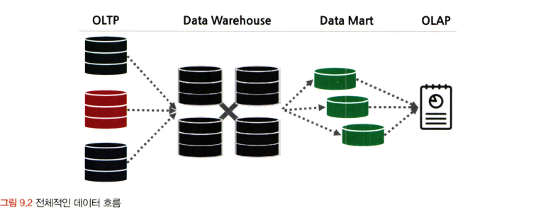

# 통계학 2주차 정규과제

📌통계학 정규과제는 매주 정해진 분량의 『*데이터 분석가가 반드시 알아야 할 모든 것*』 을 읽고 학습하는 것입니다. 이번 주는 아래의 **Statistics_2nd_TIL**에 나열된 분량을 읽고 `학습 목표`에 맞게 공부하시면 됩니다.

아래의 문제를 풀어보며 학습 내용을 점검하세요. 문제를 해결하는 과정에서 개념을 스스로 정리하고, 필요한 경우 추가자료와 교재를 다시 참고하여 보완하는 것이 좋습니다.

2주차는 `2부-08.분석 프로젝트 준비 및 기획`과 `2부-09.분석 환경 세팅하기`를 읽고 새롭게 배운 내용을 정리해주시면 됩니다.


## Statistics_2nd_TIL

### 2부. 데이터 분석 준비하기
### 08. 분석 프로젝트 준비 및 기획
### 09. 분석 환경 세팅하기


## Study Schedule

|주차 | 공부 범위     | 완료 여부 |
|----|--------------|----------|
|1주차| 1부 ~p.79    | ✅      |
|2주차| 2부 ~p.120   | ✅      | 
|3주차| 2부 ~p.202   | 🍽️      | 
|4주차| 2부 ~p.299   | 🍽️      | 
|5주차| 3부 ~p.356   | 🍽️      | 
|6주차| 3부 ~p.437   | 🍽️      | 
|7주차| 3부 ~p.542   | 🍽️      | 
|8주차| 3부 ~p.615   | 🍽️      | 
|9주차|데이터 분석 실습| 🍽️      |

<!-- 여기까진 그대로 둬 주세요-->

# 08. 분석 프로젝트 준비 및 기획

```
✅ 학습 목표 :
* 데이터 분석 프로세스를 설명할 수 있다.
* 비즈니스 문제를 정의할 때 주의할 점을 설명할 수 있다.
* 외부 데이터를 수집하는 방법에 대해 인식한다.
```
<!-- 새롭게 배운 내용을 자유롭게 정리해주세요.-->
초반부에는 비즈니스 문제와 해결 방향을 명확히 정의하고 데이터를 탐색.

중반부에는 데이터를 목적에 맞도록 수집 및 가공하고 필요에 따라 머신러닝 모델을 사용.

후반부에는 데이터 분석 결과를 검토 및 검증하고 실제 환경에 적용.

이후에는 적용한 방법의 효과를 지속적으로 모니터링하고 성과를 측정하고 보완하는 단계 수반. 

## 비즈니스 문제 정의와 분석 목적 도출
성공적인 데이터 분석 프로젝트를 위해서
- 프로젝트를 시작하기 전에 현재의 문제를 명확하게 정의
- 그에 맞는 데이터 목적 설정
- 비즈니스 이해 및 문제 정의가 조금이라도 잘못되면 최종 인사이트 도출 및 솔루션 적용 단계에서 제대로 된 효과를 보기 힘듦

- 직접 의미 있는 변수를 찾아내고 분석 방향을 설정하는 것은 도메인 지식이 충분하게 수반됐을 때 가능하다.

## 8.5 외부 데이터 수집과 크롤링
외부 데이터 수집: 정형, 반정형, 비정형 등의 다양한 유형의 데이터를 수집하는 것
- 데이터 구매
- 오픈 데이터 수집
- 크롤링: 웹 페이지 내에 있는 링크들을 따라가면서 모든 내용을 다 가져오는 것 (파이썬에서는 BeautifulSoup이나 Selenium 라이브러리 활용함함)
- 스크래핑: 웹 페이지에서 자신이 원하는 부분의 정보만 가져오는 것것


# 09. 분석 환경 세팅하기

```
✅ 학습 목표 :
* 데이터 분석의 전체적인 프로세스를 설명할 수 있다.
* 테이블 조인의 개념과 종류를 이해하고, 각 조인 방식의 차이를 구분하여 설명할 수 있다.
* ERD의 개념과 역할을 이해하고, 기본 구성 요소와 관계 유형을 설명할 수 있다.
```

<!-- 새롭게 배운 내용을 자유롭게 정리해주세요.-->
## 9.2 데이터 처리 프로세스 이해하기
### 데이터 흐름
OLTP -> DW(ODS) -> DM -> OLAP



OLTP : 실시간으로 데이터를 트랜잭션 단위로 수집, 분류, 저장하는 시스템

DW(Data Warehouse) : 수집된 데이터를 사용자의 관점에서 주제별로 통합하여 쉽게 원하는 데이터를 빼낼 수 있도록 저장해 놓은 통합 데이터베이스

DM(Data Mart) : 사용자의 목적에 맞도록 가공된 일부의 데이터가 저장되는 곳


### ETL 
: 저장된 데이터를 사용자가 요구하는 포맷으로 변형하여 이동시키는 작업 과정 
- Extract: 원천 소스 데이터베이스로부터 필요한 데이터를 읽어 들이는 과정
- Transform: 미변환 상태의 raw 데이터를 정리, 필터링, 정형화하고 요약하여 분석에 적합한 상태로 바꾸어 놓는 과정
- Load: 변환된 데이터를 새로운 테이블(목표 시스템)에 적재하는 과정  


## 9.4 테이블 조인과 정의서 그리고 ERD

### 테이블 조인
조인 : 2개 이상의 테이블을 공통의 칼럼으로 결합하는 것

### 레프트 조인과 라이트 조인
하나의 테이블을 기준으로 다른 테이블에서 겹치는 부분을 결합

-> 기준이 되는 테이블의 데이터는 그대로 유지하면서 조인하는 테이블의 데이터만 추가 

.png)

### 이너 조인과 풀 조인
이너 조인 : 두 테이블 간에 겹치는 부분의 행만 가져오는 조인 방법

.png)

풀 조인 : 모든 행을 살리는 조인 방법. 조인 되지 않은 부분은 결측값이 됨

### 크로스 조인
값이 없더라도 모든 행이 생기도록 데이터 가공을 해야 할 때 크로스 조인 사용. 

### ERD
Entity Relationship Diagram
: 각 테이블의 구성 정보와 테이블 간 관계를 도식으로 표현한 그림 형태로 구성

- 테이블은 entity
- 각 테이블이 어떤 테이블과 어떤 키로 연결되어 있는지 직관적으로 확인할 수 있음
- ERD의 핵심은 테이블 간 연결을 해주는 키 칼럼과 연결 관계를 의미하는 식별자

기본 키 : 테이블에 적재된 각각의 데이터를 유일하게 구분하는 키

외래 키 : 각 테이블 간에 연결을 만들기 위해서 테이블에서 다른 테이블의 참조되는 기본 키 


<br>
<br>

# 확인 문제

## 문제 1.

> **🧚 아래의 테이블을 조인한 결과를 출력하였습니다. 어떤 조인 방식을 사용했는지 맞춰보세요.**

> 사용한 테이블은 다음과 같습니다.

|
---|---|

> 보기: INNER, LEFT, RIGHT 조인

<!-- 테이블 조인의 종류를 이해하였는지 확인하기 위한 문제입니다. 각 테이블이 어떤 조인 방식을 이용하였을지 고민해보고 각 테이블 아래에 답을 작성해주세요.-->

### 1-1. 

```
left join
```

### 1-2. 

```
inner join
```

### 1-3. 

```
right join
```

### 1-4. CROSS JOIN을 수행할 경우, 결과 테이블의 행 개수는 몇 개인가요?

<!--위의 그림과 관계없는 문제입니다. CROSS JOIN을 수행하면 테이블의 행의 개수가 몇 개인지 생각해보세요.-->
```
9*5 = 45
```

## 문제 2.

> **🧚 다음과 같은 요구사항을 반영한 ERD를 설계할 때 엔터티와 주요 관계를 정의하세요.**

```
[시나리오]  

- 한 회사는 직원(Employee)을 관리하며, 각 직원은 직원 ID, 이름, 부서 ID를 가진다.
- 부서(Department)는 부서 ID, 부서명 속성을 가지며, 여러 직원이 한 부서에 속할 수 있다.
- 프로젝트(Project)는 프로젝트 ID, 프로젝트명을 가지며, 한 직원은 여러 프로젝트에 참여할 수 있다.
- 프로젝트 배정(Project_Assignment) 테이블을 통해 직원과 프로젝트 간의 관계를 관리하며, 배정 ID, 직원 ID(FK), 프로젝트 ID(FK), 배정 날짜를 포함한다. 
```

> **질문:   
1️⃣ 주요 엔터티와 그 속성을 정의하세요.   
2️⃣ 엔터티 간의 관계를 정의하세요.**

<!-- ERD에 관한 문제입니다. 엔터티의 정의와 관계 유형을 떠올려보세요.-->

```
1️⃣
1. 직원 테이블 - 직원 ID(기본키), 직원 이름, 부서 ID(외래키)
2. 부서 테이블 - 부서 ID(기본 ㅋ), 부서명
3. 프로젝트 - 프로젝트 ID(기본키키), 프로젝트명
4. 프로젝트 배정 - 배정ID(기본키), 직원ID(외래키), 프로젝트 ID(외래키), 배정 날짜

2️⃣
1. 직원 : 부서 = N : 1 (직원은 하나의 부서에 속함함)
2. 직원 : 프로젝트 = N : N (직원은 여러 프로젝트 참여 가능)
3. 프로젝트 배정 : 직원 = N : 1 (프로젝트 배정은 특정 직원에만만)
4. 프로젝트 배정 : 프로젝트 = N: 1 (프로젝트 배정은 특정 프로젝트에만) 
```

### 🎉 수고하셨습니다.
