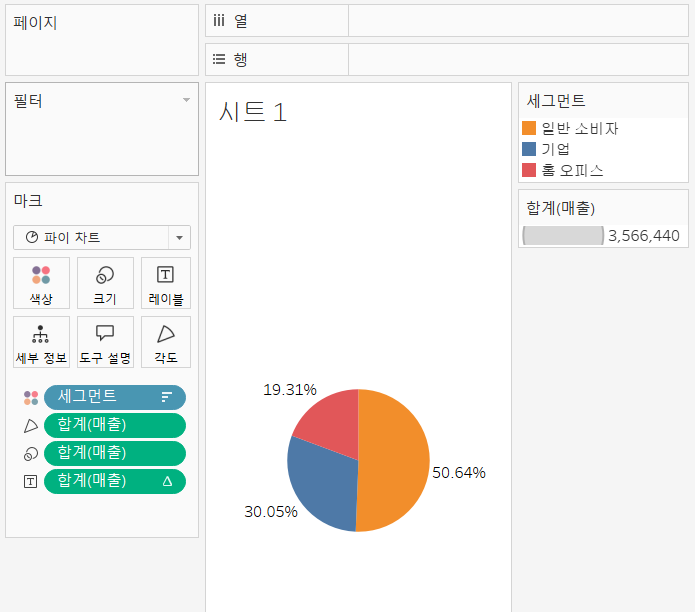
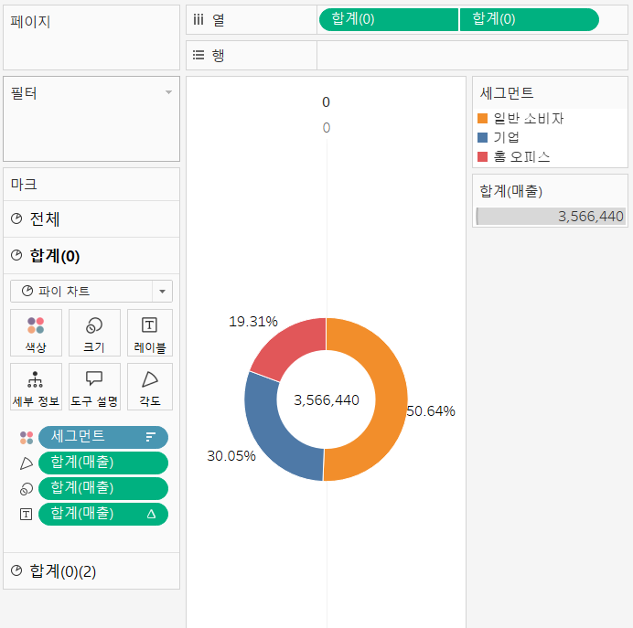
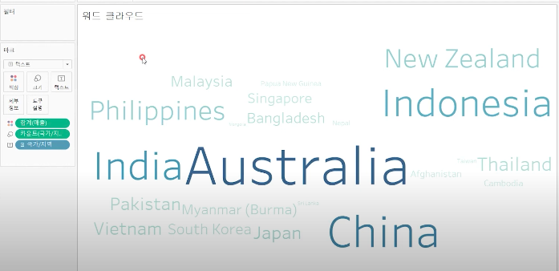

# Third Study Week

- 20강: [파이와 도넛차트](#20강-파이와-도넛차트)

- 21강: [워드와 버블차트](#21강-워드와-버블차트)

- 22강: [이중축과 결합축](#22강-이중축과-결합축)

- 23강: [분산형 차트](#23강-분산형-차트)

- 24강: [히스토그램](#24강-히스토그램)

- 25강: [박스플롯](#25강-박스플롯)

- 26강: [영역차트](#26강-영역차트)

- 27강: [간트차트](#27강-간트차트)

- 28강: [필터](#28강-필터)

- 29강: [그룹](#29강-그룹)


- 문제1 : [문제1](#문제1)

- 문제2 : [문제2](#문제2)

- 참고자료 : [참고자료](#참고-자료)


## Study Schedule

| 강의 범위     | 강의 이수 여부 | 링크                                                                                                        |
|--------------|---------|-----------------------------------------------------------------------------------------------------------|
| 1~9강        |  ✅      | [링크](https://youtu.be/3ovkUe-TP1w?si=CRjj99Qm300unSWt)       |
| 10~19강      | ✅      | [링크](https://www.youtube.com/watch?v=AXkaUrJs-Ko&list=PL87tgIIryGsa5vdz6MsaOEF8PK-YqK3fz&index=75)       |
| 20~29강      | ✅      | [링크](https://www.youtube.com/watch?v=Qcl4l6p-gHM)      |
| 30~39강      | 🍽️      | [링크](https://www.youtube.com/watch?v=e6J0Ljd6h44&list=PL87tgIIryGsa5vdz6MsaOEF8PK-YqK3fz&index=55)       |
| 40~49강      | 🍽️      | [링크](https://www.youtube.com/watch?v=AXkaUrJs-Ko&list=PL87tgIIryGsa5vdz6MsaOEF8PK-YqK3fz&index=45)       |
| 50~59강      | 🍽️      | [링크](https://www.youtube.com/watch?v=AXkaUrJs-Ko&list=PL87tgIIryGsa5vdz6MsaOEF8PK-YqK3fz&index=35)       |
| 60~69강      | 🍽️      | [링크](https://www.youtube.com/watch?v=AXkaUrJs-Ko&list=PL87tgIIryGsa5vdz6MsaOEF8PK-YqK3fz&index=25)       |
| 70~79강      | 🍽️      | [링크](https://www.youtube.com/watch?v=AXkaUrJs-Ko&list=PL87tgIIryGsa5vdz6MsaOEF8PK-YqK3fz&index=15)       |
| 80~89강      | 🍽️      | [링크](https://www.youtube.com/watch?v=AXkaUrJs-Ko&list=PL87tgIIryGsa5vdz6MsaOEF8PK-YqK3fz&index=5)        |


<!-- 여기까진 그대로 둬 주세요-->
<!-- 이 안에 들어오는 텍스트는 주석입니다. -->

# Third Study Week

## 20강: 파이와 도넛차트
<!-- 파이와 도넛차트에 관해 배우게 된 점을 적어주세요 -->
파이차트 : 전체에 대한 비율을 표시할 때 주로 사용
> 우측상단 표현 방식에서 파이차트 선택

구성비율로 보는 것이 가독성이 더 좋다. 
레이블 필드 마우스 우클릭 -> 퀵 테이블 계산에서 구성비율로 체인지 



> **🧞‍♀️ 도넛차트를 생성하는 법을 기록해주세요.**
열에 0입력하여 임의의 필드 생성 -> 필드를 CONTROL 키를 누른채 옆으로 드래그 -> 마크에 포함되어 있는 값들 삭제 -> 사이즈 조정 -> 드래그 된 필드 우클릭 이중 축 선택 



## 21강: 워드와 버블차트
<!-- 워드와 버블차트에 관해 배우게 된 점을 적어주세요 -->

버블차트 : 수치적 데이터를 원의 크기로 표현하는 차트
Control 키 누른 채 칼럼 두개 선택 -> 표현방식에서 버블차트 선택 


워드클라우드 : 문서 내에서 등장하는 키워드가 얼마나 자주 등장하는지를 텍스트 크기로 표현하여 직관적으로 시각화할 수 있는 차트

국가지역 우클릭한채 크기 마크로 드래그 -> 카운트 국가/지역 선택 -> 국가/지역 을 다시 레이블 마크로 드래그 -> 마크에서 텍스트로 변경 


## 22강: 이중축과 결합축
<!-- 이중축과 결합축에 관해 배우게 된 점을 적어주세요 -->

이중축 : 하나의 뷰어 안에서 축을 이중으로 사용하는 차트
이중축을 쓸 경우에는 마크를 각각의 축에 개별적으로 적용할 수 있음. 

주문날짜 우클릭 열 선반 드래그 -> 연속형 분기 선택 -> 매출, 수익 필드 더블클릭 -> 합치고자 하는 필드 마우스 우클릭하여 이중 축 선택 -> 양 옆 중 하나 축 동기화


결합축 : 하나의 축을 공유하는 차트임
축을 공유하는 측정값을 필요에 따라 추가할 수 있음

## 23강: 분산형 차트
<!-- 분산형 차트에 관해 배우게 된 점을 적어주세요 -->

분산형 차트는 파라미터 간의 상관관계를 파악하는데 유용한 그래프 
분산 차트는 파라미터 간 상관관계를 파악하는 데 많이 사용되는 만큼 추세선을 많이 활용함.

제조업체 필드를 세부정보 마크로 드래그 -> 범주 필드를 색상 마크로 드래그 -> 분석 칸의 추세선드래그해서 선형에 드랍 (범주에 상관없이 전체 추세를 파악하고 싶으면) 추세선 우클릭 모든 추세선 편집 -> 범주 체크 해제하기
```js
강의 영상과 달리, 우리 파일에는 '제조 업체' 필드가 없습니다. 필요한 경우, 계산된 필드를 이용해 'SPLIT([제품 이름], ' ', 1)'를 '제조 업체'로 정의하시고 세부 정보에 놓아주세요.
```


## 24강: 히스토그램
<!-- 히스토그램에 관해 배우게 된 점을 적어주세요 -->

히스토그램 : 분포 형태를 표현하는 차트. 

- 모양은 막대그래프와 비슷하지만 불연속형이 아닌 연속형 측정값을 범위 혹은 구간 차원으로 그룹화한다는 점에서 차이가 있음. 

- 차원 필드 없이 측정값만으로 그래프를 그릴때 주로 사용하는 표현 방식
* 구간차원 : 일정한 크기의 포켓을 만들어 그 안에 값을 담아 표현시키기 위한 도구
* 구간차원 크기: 구간별로 담을 포켓의 크기

구간차원 생성하기
매출필드 마우스 우클릭 -> 만들기 -> 구간 차원 클릭 -> 매출(구간차원) 열 선반 드래그 -> 연속형으로 변경 -> 매출 행 선반 드래그 매출필드 마우스 우클릭 측정값을 카운트로 변경

수익에 대한 히스토그램
매출필드 열 선반으로 드래그 -> 표현방식에서 히스토그램 선택 ->

자체 생성된 구간 차원의 값 크기를 조정하고 싶으면 -> 데이터 패널에서 수익(구간 차원) 우클릭 -> 편집 -> 구간 차원 크기를 값 입력으로 전환

## 25강: 박스플롯
<!-- 박스플롯에 관해 배우게 된 점을 적어주세요 -->

박스플롯 : 데이터의 분포를 파악하는 데 사용하는 그래프
- 장점: 다섯 개의 구간 범위를 그림으로 표현해 분포와 이상치 등을 한눈에 볼 수 있음
- 데이터 전처리와 분포 분석을 통한 인사이트 도출 시 많이 사용되는 그래프
-1사분위(Q1) : 데이터의 25% 위치
-2사분위(Q2) : 데이터의 50%의 위치, 중앙값(값들의 평균값이 아닌 중앙에 위치한 값)
-3사분위(Q3) : 데이터의 75%의 위치, 

IQR: 분포의 퍼짐을 표현하는 지표, Q1부터 Q3까지의 범위. 수치는 Q3 - Q1

바깥 울타리 = Q3 + 1.5*IQR
안쪽 울타리 = Q3 - 1.5*IQR

울타리 범위 밖의 값 = 이상치, 아웃라이어


## 26강: 영역차트
<!-- 영역차트에 관해 배우게 된 점을 적어주세요 -->

영영차트 : 라인과 축 사이의 공간이 색상으로 채워진 라인 차트. 주로 연속형 데이터의 누계를 표현하는데 사용됨. 


## 27강: 간트차트
<!-- 간트차트에 관해 배우게 된 점을 적어주세요 -->

## 28강: 필터
<!-- 필터에 관해 배우게 된 점을 적어주세요 -->

## 29강: 그룹
<!-- 그룹에 관해 배우게 된 점을 적어주세요 -->

## 문제 1.

```js
유정이는 superstore 데이터셋에서 '주문' 테이블을 보고 있습니다.
1) 국가/지역 - 시/도- 도시 의 계층을 생성했습니다. 계층 이름은 '위치'로 설정하겠습니다.
2) 날짜의 데이터 타입을 '날짜'로 바꾸었습니다.

코로나 시기의 도시별 매출 top10을 확인하고자
1) 배송 날짜가 코로나시기인 2021년, 2022년에 해당하는 데이터를 필터링했고
2) 위치 계층을 행으로 설정해 펼쳐두었습니다.
이때, 매출의 합계가 TOP 10인 도시들만을 보았습니다.
```


```
겉보기에는 전체 10개로, 잘 나온 결과처럼 보입니다. 그러나 유정이는 치명적인 실수를 저질렀습니다.
오늘 배운 '컨텍스트 필터'의 내용을 고려하여 올바른 풀이 및 결과를 구해주세요.
```

<!-- DArt-B superstore가 아닌 개인 superstore 파일을 사용했다면 값이 다르게 표시될 수 있습니다.-->

## 문제 2.

```js
태영이는 관심이 있는 제품사들이 있습니다. '제품 이름' 필드에서 '삼성'으로 시작하는 제품들을 'Samsung group'으로, 'Apple'으로 시작하는 제품들을 'Apple group'으로, 'Canon'으로 시작하는 제품들을 'Canon group'으로, 'HP'로 시작하는 제품들을 'HP group', 'Logitech'으로 시작하는 제품들을 'Logitech group'으로 그룹화해서 보려고 합니다. 나머지는 기타로 설정해주세요. 이 그룹화를 명명하는 필드는 'Product Name Group'으로 설정해주세요.

(이때, 드래그보다는 멤버 찾기 > 시작 문자 설정하여 모두 찾아 한번에 그룹화해 확인해보세요.)
```


```js
해당 그룹별로 어떤 국가/지역이 주문을 많이 차지하는지를 보고자 합니다. 매출액보다는 주문량을 보고 싶으므로, 주문Id의 카운트로 계산하겠습니다.

기타를 제외하고 지정한 5개의 그룹 하위 목들만을 이용해 아래와 같이 지역별 누적 막대그래프를 그려봐주세요.
```


