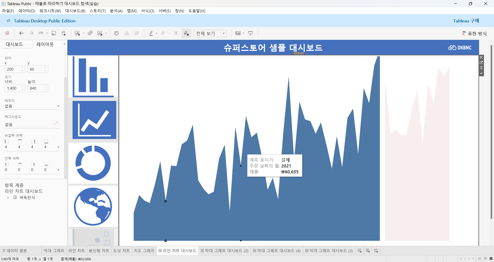
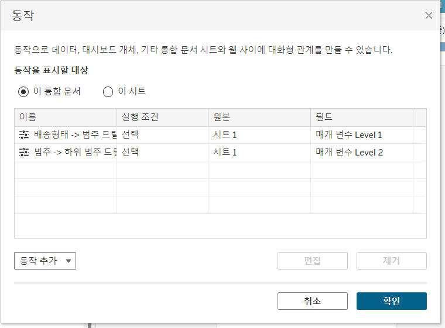
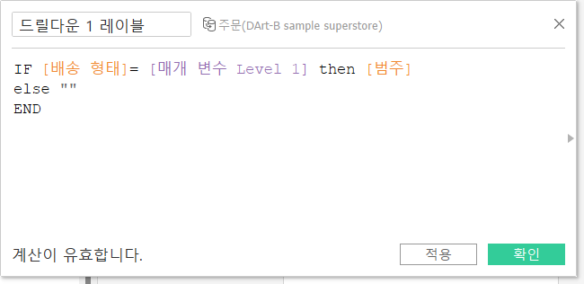
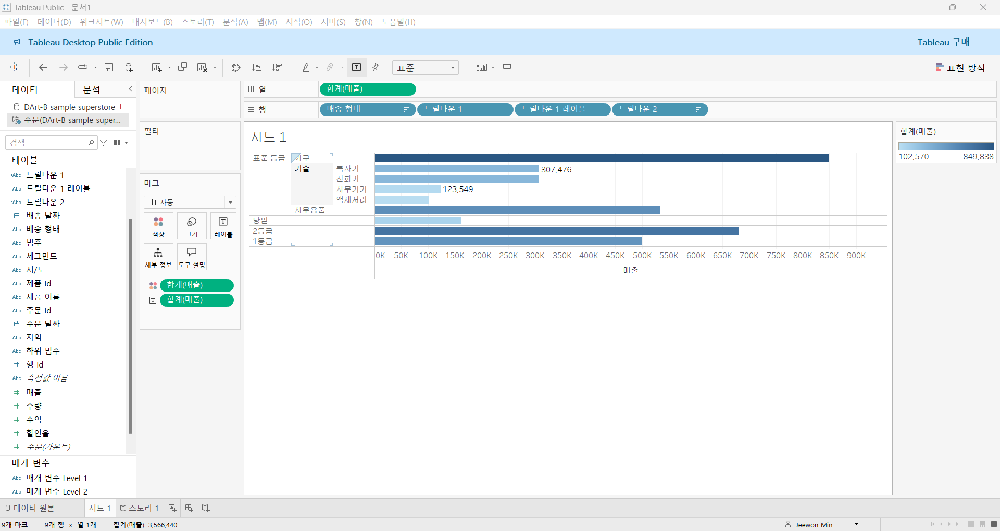

# 7th Study Week

## Study Schedule
 

| 회차 | 강의 범위   | 강의 이수 여부 | 링크                                                                                                     |
|------|-------------|----------------|--------------------------------------------------------------------------------------------------------|
| 1    | 1~7강       | ✅              | [링크](https://www.youtube.com/watch?v=AXkaUrJs-Ko&list=PL87tgIIryGsa5vdz6MsaOEF8PK-YqK3fz&index=84)    |
| 2    | 8~17강      | ✅              | [링크](https://www.youtube.com/watch?v=AXkaUrJs-Ko&list=PL87tgIIryGsa5vdz6MsaOEF8PK-YqK3fz&index=75)    |
| 3    | 18~27강     | ✅              | [링크](https://www.youtube.com/watch?v=AXkaUrJs-Ko&list=PL87tgIIryGsa5vdz6MsaOEF8PK-YqK3fz&index=65)    |
| 4    | 28~37강     | ✅              | [링크](https://www.youtube.com/watch?v=e6J0Ljd6h44&list=PL87tgIIryGsa5vdz6MsaOEF8PK-YqK3fz&index=55)    |
| 5    | 38~47강     | ✅              | [링크](https://www.youtube.com/watch?v=AXkaUrJs-Ko&list=PL87tgIIryGsa5vdz6MsaOEF8PK-YqK3fz&index=45)    |
| 6    | 48~57강     | ✅              | [링크](https://www.youtube.com/watch?v=AXkaUrJs-Ko&list=PL87tgIIryGsa5vdz6MsaOEF8PK-YqK3fz&index=35)    |
| 7    | 58~66강     | ✅             | [링크](https://www.youtube.com/watch?v=AXkaUrJs-Ko&list=PL87tgIIryGsa5vdz6MsaOEF8PK-YqK3fz&index=25)    |
| 8    | 67~77강     | 🍽️             | [링크](https://www.youtube.com/watch?v=AXkaUrJs-Ko&list=PL87tgIIryGsa5vdz6MsaOEF8PK-YqK3fz&index=15)    |
| 9    | 78~85강     | 🍽️             | [링크](https://www.youtube.com/watch?v=AXkaUrJs-Ko&list=PL87tgIIryGsa5vdz6MsaOEF8PK-YqK3fz&index=5)     |
---

 

> **🧞‍♀️ 오늘은 강의보다 실습과 대시보드 직접 만들기가 더 중요하니, 기록보다는 사고하며 강의를 들어주세요.**
> **직접 실습파일을 다운로드하는 번거로움이 있어 assignment > 7th_files에 실습파일을 올려두었습니다. 활용해주세요!**

## 58. 집합값 변경

<!-- 집합값 변경 강의에서 알게 된 점을 적어주세요 -->
집합 값 변경 : 차트에서 원하는 요소를 클릭하면 해당 요소의 하위 범주 및 관련 데이터를 표시해주는 것 

"대시보드"에 "동작" 클릭 - "동작 추가"에 "집합 값 변경" 선택 - 이름을 "집합 동작" 입력 - "대상 집합"에 "하위 범주"해당 집합 선택 - "집합의 값 할당", "집합에서 모든 값 제거" 선택

## 59강. 스토리패널

<!-- 스토리패널 강의에서 알게 된 점을 적어주세요 -->
스토리 워크시트: 각 시트를 추가함으로써 스토리 포인트를 생성할 수 있는 공간

스토리 포인트 : 스토리 각각의 개별 시트 

- 스토리 패널은 대시보드, 시트 및 텍스트 설명을 스토리 시트로 가져올 수 있음
- 스토리 툴 바는 탐색기 영역을 마우스 오버할 때 나타나며 변경된 내용을 되돌리기, 스토리 포인트에 대한 업데이트 적용, 삭제 그리고 생성이 가능 
- 탐색기는 스토리 포인트를 편집하고 구성할 수 있음 + 사용자가 탐색기를 이용해서 스토리 단계 이동 가능

## 60. 스토리

<!-- 알게 된 점을 적고, 아래 질문에 답해보세요 :) -->
- 생성된 워크시트와 대시보드에 설명을 덧붙여 데이터를 설명하거나 정보를 전달하고, 의사결정에 도움을 주고 설득력 있는 사례를 구성하는 등의 기능을 구현하는 작업이 가능함
- 스토리 포인트 별로 저장되어 각 요소 디테일하게 파악 가능
- 업데이트 저장해서 지금까지의 항목 저장 가능
- 스토리를 이용해서 스토리 포인트 간 플로우를 잘 구성하고 스토리텔링을 완성하여 내용을 분석하고 적절한 인사이트를 얻을 수 있음

## 61. 대시보드 탐색

<!-- 대시보드 탐색 강의에서 알게 된 점을 적어주세요 -->
- 이미지 개체 편집 
- 레이아웃에서 필요부분 편집 
- 탐색 개체 추가 
- ALT 키 누른채 이미지 누르면 해당하는 대시보드로 이동함

## 62. 태블로 단추

<!-- 태블로 단추 강의에서 알게 된 점을 적어주세요 -->
- 너비 편집 가능
- 표시/ 숨기기 단추 추가 -> ALT 키 누르고 X 클릭 하면 해당 그래프 사라짐
- 단추에 이미지 삽입 가능
- 단추는 표시될 항목/ 숨겨질 항목으로 나뉘어지며 지정한 항목이 표시되었을 때와 숨겼을 때의 단추의 형태 지정 가능 
- 도구 설명을 통해 단추에 마우스 오버 했을 때 표시될 설명 입력 가능
- 표시 숨기기 단추는 워크시트 뿐만 아니라 컨테이너를 대상으로도 생성 가능함

## 63. 막대그래프 드릴다운

<!-- 막대그래프 드릴다운에 대해 알게 된 점을 적어주세요 -->
드릴 다운 : 데이터를 더 세부적으로 탐색하거나 계층적으로 내려가며 분석할 수 있게 하는 기능

- 매개 변수 생성
- IF 문 사용하여 계산된 필드 만들어서 진행
- 막대 그래프의 레이블이 중복되는 것을 방지하기 위해 드릴다운에 레이블 필드 추가함

!

## 64. 트리맵 드릴다운

<!-- 트리맵 드릴다운에 대해 알게 된 점을 적어주세요 -->

## 65. 파이 차트 드릴다운

<!-- 파일 차트 드릴다운에 대해 알게 된 점을 적어주세요 -->

## 66. 지도 드릴다운

<!-- 지도 드릴다운에 대해 알게 된 점을 적어주세요 -->

---

## 문제

오늘은 별도의 문제가 없습니다.

다만, 학술제 이후 마지막 과제(11/27~)로서 한 주 동안에는 학술제 주제 관련 데이터(없을 경우, 본인 관심 데이터)를 사용해 나만의 대시보드를 제작할 예정입니다. 또한, 학술제에서 시각화 시 태블로를 사용하기를 권장하는 안내가 나갈 예정입니다.
그 때 열심히 배운 내용을 잘 활용해주세요. 감사합니다 :)
