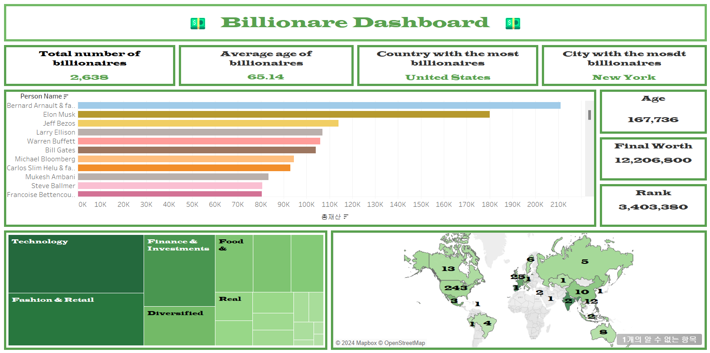
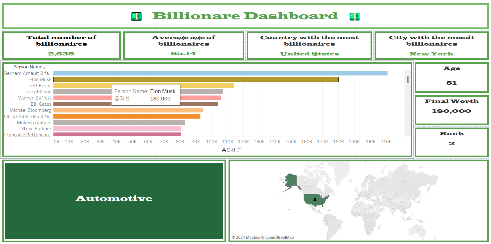

## 대시보드 제작

### 사용 데이터셋
https://www.kaggle.com/datasets/endofnight17j03/billionaires-statistics-dataset 
출처: 캐글
### Billionaires Statistics Dataset
Worldwide Wealth and Demographic Data: A Comprehensive Dataset

#
## 백만장자 분포를 보기 위한 대시보드 

### 생성한 시트
1. 억만장자가 속해 있는 산업군 (트리맵 제작)
2. 억만장자 이름 재산 순 내림차순 (막대차트 제작)
3. 국가별 억만장자 분포 (지도차트)
4. 억만장자 평균 연령
5. 총 억만장자 수 
6. 억만장자 최다 보유국
7. 억만장자 최다 보유도시
8. 억만장자 나이
9. 억만장자 재산
10. 억만장자 개인순위

### 대시보드 활용 안내
필터를 활용하여 막대 차트에 해당 억만장자에 마우스 오버 하면 억만장자가 속해 있는 산업군, 국적, 나이, 재산, 재산순위를 알 수 있게끔 설정함. 

-

### 끝 <3
